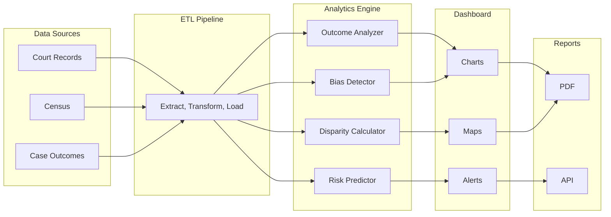

# Justice Analytics + Bias Detection Engine

**Make the invisible visible**

## The Problem

Systemic bias in court outcomes is hard to measure because the data is scattered, inconsistent, and often inaccessible. Access disparities go undetected -- no one tracks how many people abandon their case because they could not find a lawyer, could not get to the courthouse, or could not understand the paperwork. Policymakers and funders lack the data they need to direct resources effectively. Without measurement, there is no accountability, and without accountability, there is no change.

## The Solution

An analytics engine that brings transparency to the justice system. Case outcome analytics with demographic breakdowns reveal patterns that anecdotes cannot. Statistical bias detection models identify disparities that would otherwise remain invisible. Access disparity dashboards show where the justice gap is widest. Predictive risk indicators help organizations intervene before problems escalate. All built with privacy-preserving techniques so that transparency does not come at the cost of individual privacy.



## Who This Helps

- **Policymakers** -- legislators and agency heads who need data to craft evidence-based justice reform
- **Court administrators** -- leaders who want to identify and address disparities in their own courts
- **Legal aid funders** -- foundations and government grantmakers who need to direct resources where they are needed most
- **Researchers** -- academics studying systemic bias, access to justice, and court outcomes
- **Civil rights organizations** -- advocates who need data to support impact litigation and policy campaigns

## Features

- Case outcome analytics with demographic breakdowns across race, income, geography, and representation status
- Statistical bias detection models that identify statistically significant disparities in outcomes
- Access disparity dashboards with geographic and demographic visualizations
- Predictive risk indicators that flag cases and populations at risk of falling through the cracks
- Exportable reports for funders in PDF and API formats
- Privacy-preserving analytics using differential privacy and k-anonymity techniques

## Quick Start

```bash
npm install @justice-os/analytics
```

```ts
import { OutcomeAnalyzer, BiasDetector } from '@justice-os/analytics';
```

## Development

```bash
git clone https://github.com/dougdevitre/justice-analytics.git
cd justice-analytics
npm install
npm run dev       # Start dev server
npm run test      # Run tests
npm run build     # Build for production
```

## License

MIT -- see [LICENSE](./LICENSE) for details.
