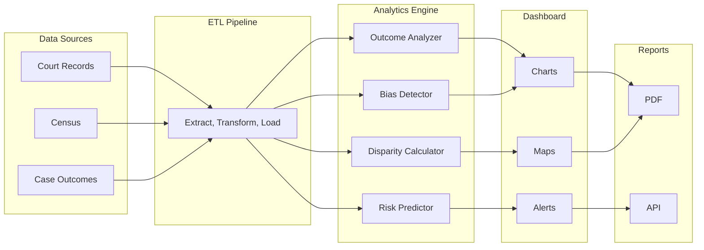

# Justice Analytics + Bias Detection Engine

**Make the invisible visible**

## The Problem

Systemic bias in court outcomes is hard to measure because the data is scattered, inconsistent, and often inaccessible. Access disparities go undetected -- no one tracks how many people abandon their case because they could not find a lawyer, could not get to the courthouse, or could not understand the paperwork. Policymakers and funders lack the data they need to direct resources effectively. Without measurement, there is no accountability, and without accountability, there is no change.

## The Solution

An analytics engine that brings transparency to the justice system. Case outcome analytics with demographic breakdowns reveal patterns that anecdotes cannot. Statistical bias detection models identify disparities that would otherwise remain invisible. Access disparity dashboards show where the justice gap is widest. Predictive risk indicators help organizations intervene before problems escalate. All built with privacy-preserving techniques so that transparency does not come at the cost of individual privacy.



## Who This Helps

- **Policymakers** -- legislators and agency heads who need data to craft evidence-based justice reform
- **Court administrators** -- leaders who want to identify and address disparities in their own courts
- **Legal aid funders** -- foundations and government grantmakers who need to direct resources where they are needed most
- **Researchers** -- academics studying systemic bias, access to justice, and court outcomes
- **Civil rights organizations** -- advocates who need data to support impact litigation and policy campaigns

## Features

- Case outcome analytics with demographic breakdowns across race, income, geography, and representation status
- Statistical bias detection models that identify statistically significant disparities in outcomes
- Access disparity dashboards with geographic and demographic visualizations
- Predictive risk indicators that flag cases and populations at risk of falling through the cracks
- Exportable reports for funders in PDF and API formats
- Privacy-preserving analytics using differential privacy and k-anonymity techniques

## Quick Start

```bash
npm install @justice-os/analytics
```

```ts
import { BiasDetector } from '@justice-os/analytics';

// Initialize with significance thresholds
const detector = new BiasDetector({
  significanceLevel: 0.05,
  minimumSampleSize: 30,
});

// Detect bias in sentencing outcomes by race
const result = await detector.detectBias(
  'CA',                        // jurisdiction
  'sentence_length',           // outcome metric
  'race',                      // protected attribute
  ['case_type', 'prior_record'], // control variables
);

console.log(result.finding);        // "significant_disparity" | "no_significant_disparity"
console.log(result.disparityRatio); // ratio of outcome between groups
console.log(result.effectSize);     // Cohen's d

// Run a full audit across all metrics and attributes
const audit = await detector.runFullAudit('CA');
const flagged = detector.filterSignificant(audit);
```

See [`examples/bias-analysis.ts`](./examples/bias-analysis.ts) for a full working example.

## Development

```bash
git clone https://github.com/dougdevitre/justice-analytics.git
cd justice-analytics
npm install
npm run dev       # Start dev server
npm run test      # Run tests
npm run build     # Build for production
```

## Roadmap

| Feature | Status |
|---------|--------|
| BiasDetector with regression analysis stubs | Done |
| OutcomeAnalyzer with demographic breakdowns | Done |
| ETL pipeline with privacy layer (k-anonymity) | In Progress |
| Geographic disparity mapping | In Progress |
| PDF report export for funders | Planned |
| Real-time alert system for emerging disparities | Planned |

## License

MIT -- see [LICENSE](./LICENSE) for details.

---

## Justice OS Ecosystem

This repository is part of the **Justice OS** open-source ecosystem — 32 interconnected projects building the infrastructure for accessible justice technology.

### Core System Layer
| Repository | Description |
|-----------|-------------|
| [justice-os](https://github.com/dougdevitre/justice-os) | Core modular platform — the foundation |
| [justice-api-gateway](https://github.com/dougdevitre/justice-api-gateway) | Interoperability layer for courts |
| [legal-identity-layer](https://github.com/dougdevitre/legal-identity-layer) | Universal legal identity and auth |
| [case-continuity-engine](https://github.com/dougdevitre/case-continuity-engine) | Never lose case history across systems |
| [offline-justice-sync](https://github.com/dougdevitre/offline-justice-sync) | Works without internet — local-first sync |

### User Experience Layer
| Repository | Description |
|-----------|-------------|
| [justice-navigator](https://github.com/dougdevitre/justice-navigator) | Google Maps for legal problems |
| [mobile-court-access](https://github.com/dougdevitre/mobile-court-access) | Mobile-first court access kit |
| [cognitive-load-ui](https://github.com/dougdevitre/cognitive-load-ui) | Design system for stressed users |
| [multilingual-justice](https://github.com/dougdevitre/multilingual-justice) | Real-time legal translation |
| [voice-legal-interface](https://github.com/dougdevitre/voice-legal-interface) | Justice without reading or typing |
| [legal-plain-language](https://github.com/dougdevitre/legal-plain-language) | Turn legalese into human language |

### AI + Intelligence Layer
| Repository | Description |
|-----------|-------------|
| [vetted-legal-ai](https://github.com/dougdevitre/vetted-legal-ai) | RAG engine with citation validation |
| [justice-knowledge-graph](https://github.com/dougdevitre/justice-knowledge-graph) | Open data layer for laws and procedures |
| [legal-ai-guardrails](https://github.com/dougdevitre/legal-ai-guardrails) | AI safety SDK for justice use |
| [emotional-intelligence-ai](https://github.com/dougdevitre/emotional-intelligence-ai) | Reduce conflict, improve outcomes |
| [ai-reasoning-engine](https://github.com/dougdevitre/ai-reasoning-engine) | Show your work for AI decisions |

### Infrastructure + Trust Layer
| Repository | Description |
|-----------|-------------|
| [evidence-vault](https://github.com/dougdevitre/evidence-vault) | Privacy-first secure evidence storage |
| [court-notification-engine](https://github.com/dougdevitre/court-notification-engine) | Smart deadline and hearing alerts |
| [justice-analytics](https://github.com/dougdevitre/justice-analytics) | Bias detection and disparity dashboards |
| [evidence-timeline](https://github.com/dougdevitre/evidence-timeline) | Evidence timeline builder |

### Tools + Automation Layer
| Repository | Description |
|-----------|-------------|
| [court-doc-engine](https://github.com/dougdevitre/court-doc-engine) | TurboTax for legal filings |
| [justice-workflow-engine](https://github.com/dougdevitre/justice-workflow-engine) | Zapier for legal processes |
| [pro-se-toolkit](https://github.com/dougdevitre/pro-se-toolkit) | Self-represented litigant tools |
| [justice-score-engine](https://github.com/dougdevitre/justice-score-engine) | Access-to-justice measurement |
| [justice-app-generator](https://github.com/dougdevitre/justice-app-generator) | No-code builder for justice tools |

### Quality + Testing Layer
| Repository | Description |
|-----------|-------------|
| [justice-persona-simulator](https://github.com/dougdevitre/justice-persona-simulator) | Test products against real human realities |
| [justice-experiment-lab](https://github.com/dougdevitre/justice-experiment-lab) | A/B testing for justice outcomes |

### Adoption Layer
| Repository | Description |
|-----------|-------------|
| [digital-literacy-sim](https://github.com/dougdevitre/digital-literacy-sim) | Digital literacy simulator |
| [legal-resource-discovery](https://github.com/dougdevitre/legal-resource-discovery) | Find the right help instantly |
| [court-simulation-sandbox](https://github.com/dougdevitre/court-simulation-sandbox) | Practice before the real thing |
| [justice-components](https://github.com/dougdevitre/justice-components) | Reusable component library |
| [justice-dev-starter-kit](https://github.com/dougdevitre/justice-dev-starter-kit) | Ultimate boilerplate for justice tech builders |

> Built with purpose. Open by design. Justice for all.


---

### ⚠️ Disclaimer

This project is provided for **informational and educational purposes only** and does **not** constitute legal advice, legal representation, or an attorney-client relationship. No warranty is made regarding accuracy, completeness, or fitness for any particular legal matter. **Always consult a licensed attorney** in your jurisdiction before making legal decisions. Use of this software does not create any professional-client relationship.

---

### Built by Doug Devitre

I build AI-powered platforms that solve real problems. I also speak about it.

**[CoTrackPro](https://cotrackpro.com)** · admin@cotrackpro.com

→ **Hire me:** AI platform development · Strategic consulting · Keynote speaking

> *AWS AI/Cloud/Dev Certified · UX Certified (NNg) · Certified Speaking Professional (NSA)*
> *Author of Screen to Screen Selling (McGraw Hill) · 100,000+ professionals trained*
