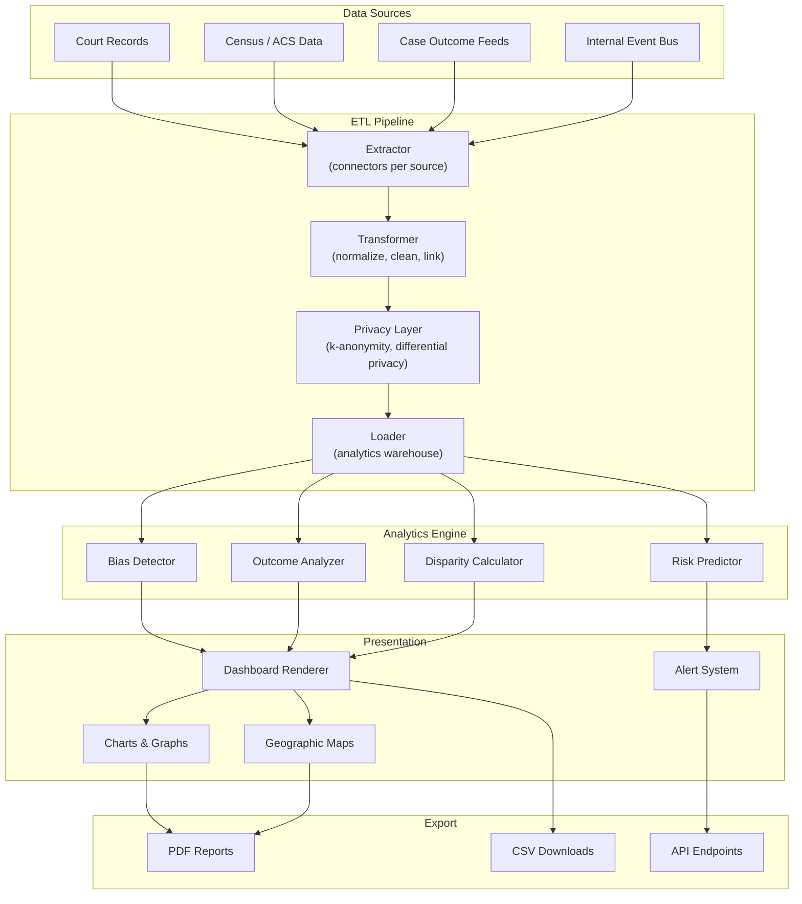
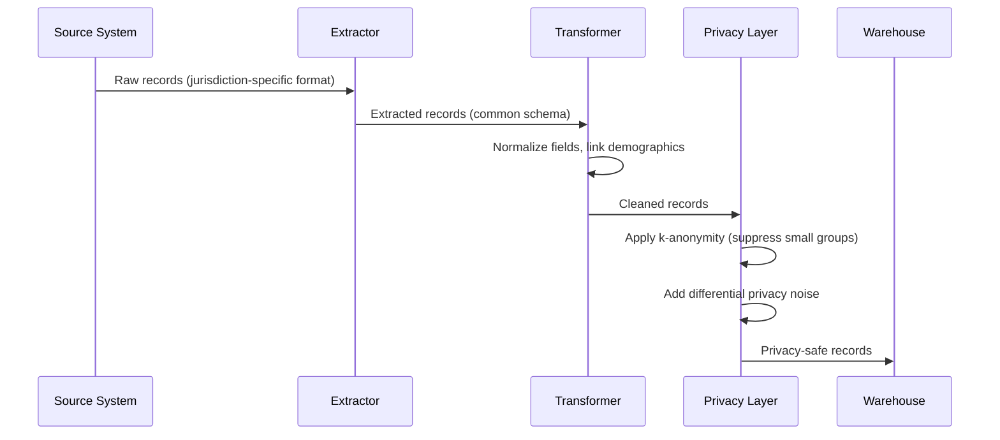
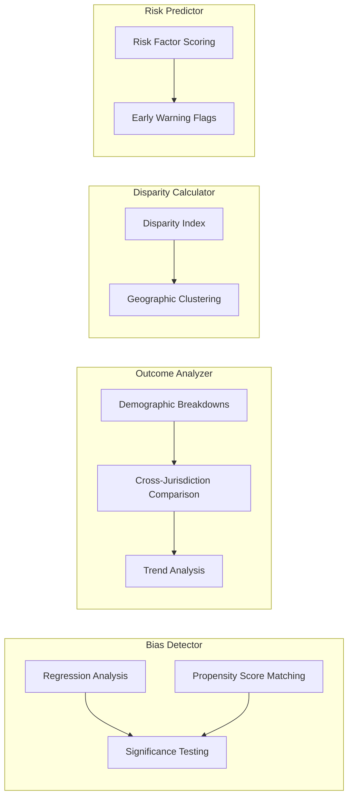
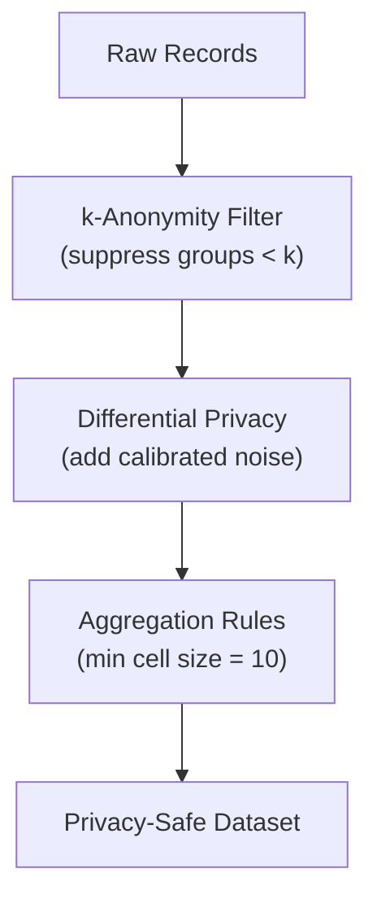

# Justice Analytics -- Architecture

## System Overview

Data flows from court records and census sources through an ETL pipeline into the analytics engine, which runs bias detection, outcome analysis, and disparity calculations. Results are rendered on dashboards and exported as reports -- all behind a privacy layer.

## ETL Pipeline Detail

## Analytics Engine -- Component Interaction

## Privacy Layer Architecture

All data passes through privacy controls before it enters the analytics warehouse. Small demographic groups are suppressed and statistical noise is added to prevent re-identification.

